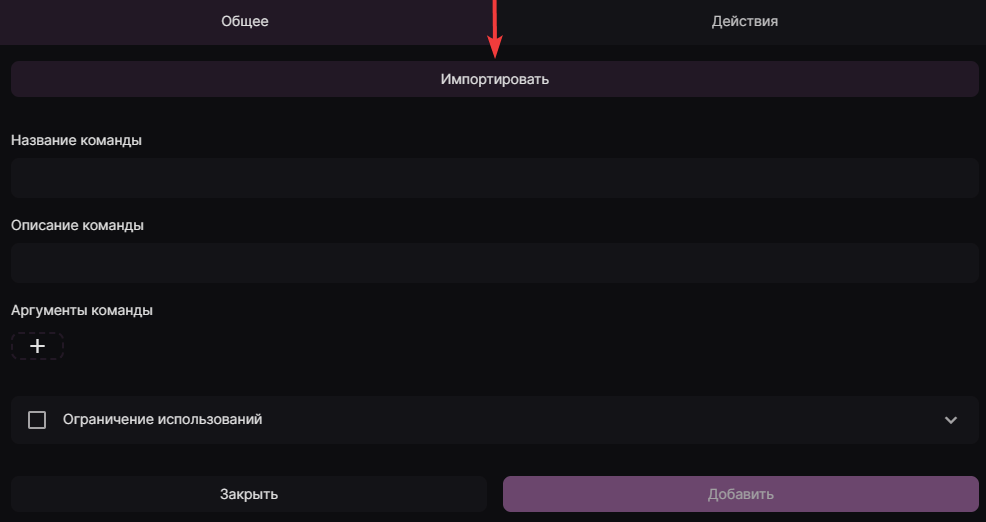
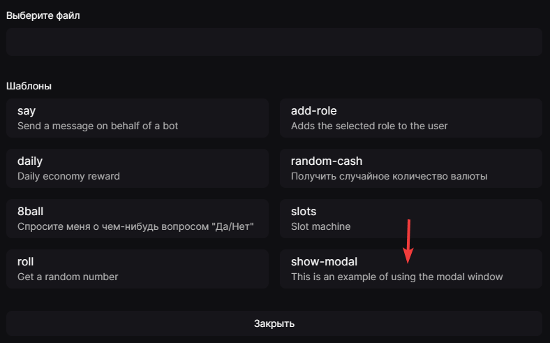
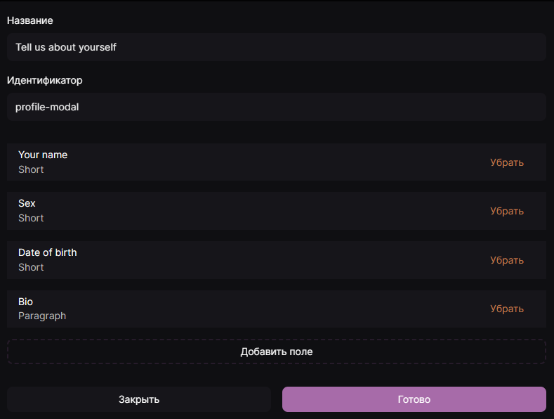
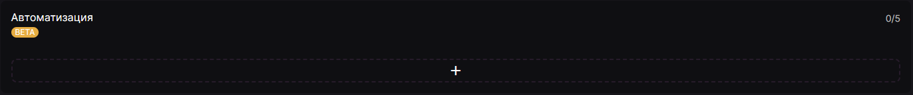
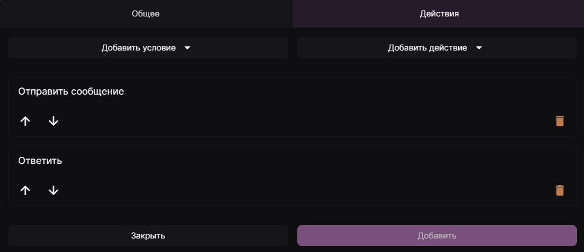
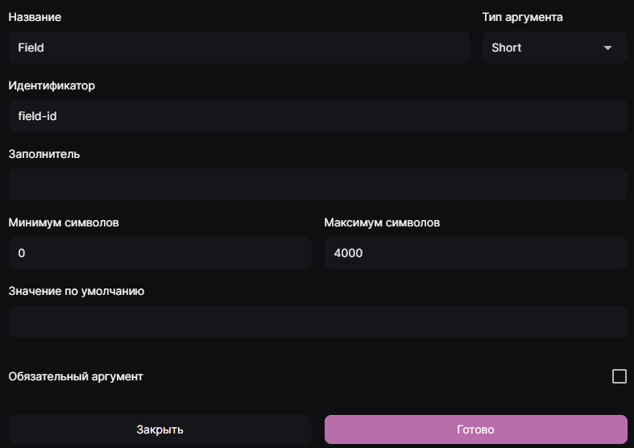
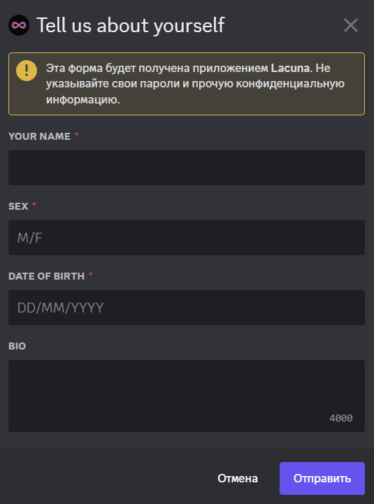

# Создание модальных окон

Для создания модальных окон вам понадобится создать пользовательскую команду и автоматизацию в панеле бота. Чтобы создать пользовательскую команду для модального окна, вы можете использовать шаблон `show-modal` и настроить все по вашему вкусу.

---

---

С помощью автоматизации с триггером **Отправка формы модального окна** вы можете производить различные действия с полученными данными. В частности, их можно переслать в необходимый канал или вернуть пользователю.

Если на сервере имеется подписка Lacuna Diamond, вы можете использовать действие "Выполнить код" для выполнения как вышеописанных, так и некоторых других функций, недоступных без подписки. Подробнее см. [Функции](./functions.md). Пример работы с кодом размещен в шаблоне **Using modals**.

---

Вышеописанные функции принимают аргументы, описанные в статье [Типы данных](./data-types.md).

## Заполнители и Идентификаторы
**Идентификаторы** используются для того, чтобы отличить одни элементы от других, а название идентификатора будет показываться участнику при открытии модального окна. **Заполнитель** - это значение, которое отображается внутри поля ввода, пока оно не заполнено. Его можно использовать, например, в связке с заголовком поля в качестве подсказки для пользователя, что именно нужно указать в данном поле.

---

