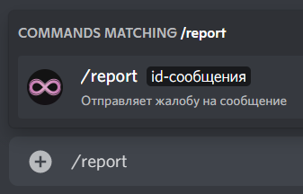

# Репорты

Репорты — это способ сообщить администрации сервера о контенте в текстовом канале, который нарушает общие правила Discord или конкретно сервера.

Для их использования на сервере должны быть включены cлэш-команды во вкладке **"Команды"** и сами репорты во вкладке **"Полезное"** панели управления, а также установлен канал для сообщений.

Cамо же **использование** репортов происходит через использование слеш-команды `/report`.

Или через контекстное меню сообщения: ПКМ по сообщению -> Приложения -> Пожаловаться.

После чего в ранее настроенном канале отобразится информация о репорте.
